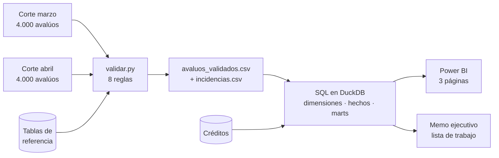

# Manual del proyecto — `cartera-garantias-dq`

**Análisis de confiabilidad de una cartera de garantías inmobiliarias**

Versión del manual: 3.0 · Reemplaza a la v1 (sistema de validación) y a la v2 (análisis sin reglas)

> **Aviso de transparencia.** Este es un proyecto de portafolio. El problema que aborda es real y ocurre en bancos y financieras. **El caso, la entidad y los datos son simulados.** Ninguna cifra de este repositorio describe el desempeño de una organización existente.

---

## Cómo leer este manual

| Si sos… | Leé |
|---|---|
| Ejecutivo o reclutador | Secciones 1 a 3 y 13 (≈ 5 minutos) |
| Analista de datos o de riesgo | Secciones 4 a 12 |
| Alguien que no trabaja con datos | Secciones 1, 2, 6 y 8 |

---

## 1. Qué es esto, en un párrafo

Un banco tiene miles de créditos respaldados por propiedades. El valor de cada propiedad viene de un avalúo. Si el avalúo tiene errores o está vencido, **el banco no sabe realmente cuánto vale su garantía**.

Este proyecto toma dos extracciones mensuales de esa cartera, les aplica ocho reglas de calidad definidas con criterio de valuación, y responde una pregunta que hoy nadie puede contestar con un número: *¿qué porcentaje de la exposición crediticia está respaldado por avalúos confiables, y cuáles conviene atender primero?*

La salida no es un tablero bonito. Es **una lista de trabajo priorizada** para el equipo que tiene capacidad de re-inspeccionar 150 propiedades al mes y una cartera de miles.

---

## 2. El problema de negocio

### El proceso

Cada crédito con garantía real tiene un avalúo asociado. Ese avalúo determina el valor de la garantía, y con él la relación préstamo/valor (LTV), las provisiones y los reportes de riesgo.

### El pain point

La cartera envejece y se degrada, pero nadie la mide como conjunto. Las revisiones se ordenan por antigüedad o por reclamo puntual. El resultado es que **se re-valora una garantía de ₡18 millones mientras una de ₡340 millones lleva tres años sin revisar**.

### La decisión que se toma mal

| Aspecto | Hoy | Con este proyecto |
|---|---|---|
| Quién decide | Jefe de Garantías | El mismo |
| Qué decide | Qué 150 avalúos revisar este mes | Lo mismo |
| Con qué criterio | Antigüedad o reclamo | Exposición en riesgo |
| Con qué información | Una consulta al sistema, sin calidad | Cartera clasificada por confiabilidad y saldo |
| Costo del error | Capacidad gastada en garantías pequeñas | — |

### Por qué es un problema de datos y no de proceso

Nadie puede priorizar por exposición en riesgo porque **esa cifra no existe**. Requiere cruzar tres cosas que viven separadas: el avalúo, las reglas que dicen si es confiable, y el saldo del crédito que respalda. Ese cruce es el proyecto.

> **Honestidad de alcance.** Es una clase de problema documentadamente real en administración de garantías. El proyecto no afirma que ocurra en ninguna organización en particular, ni con las magnitudes que aquí se simulan.

---

## 3. Las siete preguntas

| # | Pregunta | Respuesta |
|---|---|---|
| 1 | ¿Qué problema existe? | La cartera de garantías se prioriza por antigüedad, no por riesgo, porque la exposición en riesgo no se mide |
| 2 | ¿Quién decide? | Jefe de Garantías o Gerente de Riesgo de Crédito |
| 3 | ¿Qué información necesita? | Qué proporción de la exposición tiene respaldo confiable, dónde se concentra el problema y qué atender primero |
| 4 | ¿Qué datos y métodos? | Dos cortes mensuales + 8 reglas de calidad + tablas de referencia del dominio + modelo dimensional |
| 5 | ¿Qué acción se toma? | Se emite la lista de trabajo del mes ordenada por exposición en riesgo |
| 6 | ¿Cómo se mide el valor? | Porcentaje de exposición con respaldo confiable, comparado entre cortes |
| 7 | ¿Qué no se puede afirmar? | Ver sección 15 |

---

## 4. Qué hace el proyecto, paso a paso



1. **Llegan dos archivos**, uno por mes. Así recibe datos un analista en la vida real.
2. **Se aplican ocho reglas.** Cada avalúo queda con una etiqueta de confiabilidad y el detalle de qué incumplió.
3. **Se cruza con la cartera de créditos.** Aquí el problema técnico se vuelve financiero.
4. **Se construye el modelo** en SQL: cinco dimensiones y dos tablas de hechos.
5. **Se compara marzo con abril.** Qué se corrigió, qué persiste, qué apareció nuevo.
6. **Se publica el tablero y la lista de trabajo.**

---

## 5. Qué NO hace

- No bloquea ni impide nada. **Mide.** No hay un sistema en producción reteniendo registros.
- No corrige datos. Señala qué corregir y en qué orden.
- No se conecta a sistemas bancarios, registrales ni catastrales reales.
- No convierte monedas. Colones y dólares se reportan separados.
- No usa Machine Learning. Ver decisión D-05.
- No valida contra cartografía oficial. La validación geográfica es aproximada (sección 15).

---

## 6. Conceptos clave, en lenguaje llano

**Corte.** Una extracción de la cartera en una fecha. El proyecto usa dos: marzo y abril de 2026. Es lo que reemplaza a la idea de "ejecución de un sistema": no hay motor corriendo, hay dos fotos de la misma cartera en dos momentos.

**Regla de datos.** Una condición que los datos deben cumplir, escrita en lenguaje de negocio, con un responsable. *"No pueden existir dos avalúos con el mismo identificador."* Ocho activas, dos declaradas y apagadas.

**BLOQUEA / REVISA.** Las dos consecuencias posibles. `BLOQUEA` marca un dato imposible o indefendible: un terreno baldío con 180 m² construidos. `REVISA` marca un dato sospechoso pero posible: un valor por m² muy alto puede ser un error de digitación **o** una propiedad excepcional. Tratar ambos igual sería un error de criterio.

**Nivel de confiabilidad.** La clasificación que traduce lo técnico a lo ejecutivo:

| Nivel | Significa | Qué hacer |
|---|---|---|
| **Confiable** | Ningún incumplimiento | Nada |
| **Revisar** | Solo incumplimientos de tipo REVISA | Verificación documental |
| **No confiable** | Al menos un BLOQUEA | Re-inspección |

**Exposición.** El saldo del crédito que la garantía respalda. Es lo que convierte "hay 320 avalúos con error" en "hay ₡X mil millones sin respaldo confiable".

**LTV.** Saldo del crédito dividido por el valor de la garantía. Un LTV alto sobre un avalúo no confiable es la peor combinación de la cartera. Por regla de diseño, la moneda del crédito es siempre la del avalúo: sin eso el cociente mezclaría colones con dólares y no significaría nada.

**Reconciliación.** Verificar que los registros que entraron son exactamente los que salieron. En este proyecto no es una alarma automática: es **una tabla de control visible en el tablero**, porque un análisis cuyas cifras no cuadran no debería presentarse.

---

## 7. Las reglas de datos

Esta es la parte de gobierno del proyecto. El catálogo completo, con responsables y justificaciones, vive en `reference/reglas_datos.csv`.

### Activas

| ID | Regla, en lenguaje de negocio | Dimensión | Acción | Responsable |
|---|---|---|---|---|
| R-01 | No pueden existir dos avalúos con el mismo identificador | Unicidad | BLOQUEA | Coordinación de Calidad |
| R-02 | Los campos obligatorios deben venir informados | Completitud | BLOQUEA | Coordinación de Calidad |
| R-03 | El valor total debe cuadrar con la suma de sus componentes | Consistencia | BLOQUEA | Perito Revisor |
| R-04 | La tipología y lo construido deben ser compatibles | Consistencia | BLOQUEA | Perito Revisor |
| R-05 | Las fechas deben tener orden lógico | Cronología | BLOQUEA | Coordinación de Calidad |
| R-06 | La coordenada debe corresponder al distrito declarado | Integridad | REVISA | Perito Revisor |
| R-07 | El valor por m² debe estar dentro del rango de la zona | Plausibilidad | REVISA | Perito Revisor |
| R-08 | El avalúo no debe superar la vigencia de política | Vigencia | REVISA | Jefe de Garantías |

### Por qué cada una bloquea o solo revisa

Este razonamiento es el que demuestra criterio, más que las reglas mismas:

- **R-01 a R-05 bloquean** porque describen datos **imposibles**, no improbables. Un identificador duplicado, una fecha de inspección posterior a la de valor o un total que no cuadra no admiten interpretación benigna: alguien se equivocó.
- **R-06 a R-08 revisan** porque describen datos **sospechosos**. Una coordenada fuera del radio del distrito puede ser un error o una propiedad en el límite. Un avalúo vencido —más de 24 meses desde la fecha de valor, umbral de política asumido— sigue siendo un avalúo válido, solo que viejo. Bloquear estos casos generaría tanto ruido que el negocio aprendería a ignorar la alerta — y una regla que todos desatienden es peor que no tenerla.

### Declaradas y apagadas

| ID | Qué haría | Por qué está apagada |
|---|---|---|
| R-09 | Verificar que el área construida sea proporcional al terreno | **Técnico:** faltan calibrar los rangos de cobertura por tipología |
| R-10 | Detectar coordenadas idénticas entre fincas distintas | **Técnico:** falta definir el umbral de precisión decimal |

Que estén apagadas y documentadas es control de cambios. Una regla no entra al catálogo porque se pueda programar, sino porque alguien puede responder por ella.

---

## 8. El recorrido completo: un avalúo entre marzo y abril

Esta es la mejor demostración del proyecto, y son dos consultas SQL, no un sistema de gestión de casos.

**Corte de marzo.** El avalúo `AV-2026-001847` respalda un crédito con saldo de ₡312 millones. Declara tipología «Terreno baldío urbano» y 180 m² de construcción.

1. **R-04 falla:** una tipología sin construcción no puede declarar área edificada. Acción `BLOQUEA`.
2. **R-03 también falla:** el valor total no cuadra con la suma de componentes.
3. Nivel de confiabilidad: **No confiable**.
4. Con ₡312 millones de saldo, entra en el **percentil superior de exposición en riesgo**. Aparece de primero en la lista de trabajo del mes — cosa que con el criterio de antigüedad no habría pasado, porque el avalúo tiene apenas ocho meses.

**Corte de abril.** El perito corrigió la tipología a «Casa de habitación» y el total ahora cuadra.

5. La misma finca, con la misma fecha de valor, ya no genera incumplimientos.
6. La consulta de evolución lo clasifica como **corregido**.
7. La exposición en riesgo del cantón baja en ₡312 millones.

Ese recorrido —detectar, explicar la causa, priorizar por consecuencia, corregir y verificar— es el proyecto completo. **No requiere estados, ni relojes, ni identificadores de ejecución.** Requiere dos cortes y un `FULL OUTER JOIN`.

---

## 9. Los datos

### Qué se genera

| Tabla | Filas | Contenido |
|---|---|---|
| `avaluos_2026_03.csv` | 4.000 | Corte de marzo |
| `avaluos_2026_04.csv` | 4.000 | Corte de abril |
| `creditos.csv` | 3.200 | Saldo, fecha de desembolso y estado |

El 80 % de los avalúos respalda un crédito vigente. El resto corresponde a finalidades sin exposición —seguro, contable, compraventa— y sirve para que el análisis distinga *garantía* de *exposición*, que no son lo mismo.

### Evolución entre cortes

La cartera no es estática: entre marzo y abril entran y salen operaciones. Parámetros de diseño del generador:

**Qué pasa con los 1.200 avalúos que incumplían en marzo**

| Destino | % de los defectuosos | Registros |
|---|---|---|
| Se corrigen | 60 % | 720 |
| Persisten sin corregir | 30 % | 360 |
| Salen de cartera | 10 % | 120 |

**Movimiento de la cartera completa**

| Concepto | Registros |
|---|---|
| Salen (crédito cancelado o garantía liberada) | 200 |
| Entran (nuevos desembolsos) | 200 |
| Nuevos incumplimientos en abril | 120 |

De donde se deriva:

| Corte | Con incumplimiento | Tasa |
|---|---|---|
| Marzo | 1.200 | 30 % |
| Abril | 480 | 12 % |

**Reducción relativa: 60 %.**

Tres decisiones deliberadas en este diseño:

- **Los 120 nuevos incumplimientos** evitan el caso de laboratorio donde el problema se resuelve solo. Un tablero que muestra mejora perfecta hace desconfiar a un lector experimentado.
- **Que salgan de cartera 120 avalúos defectuosos** —el 60 % de todas las salidas, cuando los defectuosos son apenas el 30 % de la cartera— no es un sesgo accidental. Un crédito que se cancela suele ser un crédito viejo, y un crédito viejo tiene un avalúo viejo, que es justamente el que incumple R-08 por vigencia. La correlación es parte del diseño.
- **La salida de cartera es una cuarta categoría**, y es la razón de que la comparación entre cortes necesite un `FULL OUTER JOIN` y no un `LEFT JOIN`: hay registros que existen en marzo y no en abril, y viceversa.

**Las cuatro categorías de la comparación entre cortes**

| Categoría | En marzo | En abril |
|---|---|---|
| Corregido | Incumplía | Cumple |
| Persistente | Incumplía | Sigue incumpliendo |
| Nuevo | No existía o cumplía | Incumple |
| Salió de cartera | Incumplía | No existe |

### Transparencia sobre el origen

Todos los datos son sintéticos, generados con semilla fija y reproducibles. El generador conoce qué defectos sembró, lo que permite verificar que el validador los encuentre. **Ojo con lo que eso prueba:** verifica que el código funciona, no que detectaría errores que nadie anticipó. Ver sección 15.

Las cuatro tablas de referencia —territorial, tipologías, rangos de valor unitario y peritos— contienen criterio de valuación, no datos inventados al azar. Los rangos se definen por **zona** (GAM centro, GAM periferia, ciudad intermedia, rural, costa), no por cantón: así razonan los valuadores, y 35 distritos por 9 tipologías sería una tabla imposible de mantener. Son el núcleo del proyecto y lo que un analista sin experiencia en avalúos no podría escribir.

---

## 10. Arquitectura y repositorio

```
cartera-garantias-dq/
├── README.md                     Presentación y resultados
├── src/
│   ├── verificar_referencias.py  Consistencia de las tablas de referencia
│   ├── generar.py                Datos sintéticos (se corre una vez)
│   └── validar.py                Las 8 reglas. El archivo que se lee
├── sql/
│   ├── 01_staging.sql            Tipado y normalización
│   ├── 02_dimensiones.sql        Las 5 dimensiones
│   ├── 03_hechos.sql             Las 2 tablas de hechos
│   ├── 04_marts.sql              Exposición, Pareto y evolución entre cortes
│   └── 05_control.sql            Reconciliación de cifras
├── reference/
│   ├── geografia.csv             35 distritos con zona, centroide y radio
│   ├── tipologias.csv            9 tipologías y su regla de construcción
│   ├── rangos_vu.csv             Rangos de valor unitario por zona
│   ├── peritos.csv               10 peritos seudonimizados
│   └── reglas_datos.csv          Catálogo de reglas y responsables
├── data/                         Crudos y salidas
├── dashboards/                   Power BI y capturas
├── reports/memo_ejecutivo.md     Hallazgos y recomendaciones
└── docs/
    ├── MANUAL.md                 Este documento
    └── diccionario_datos.md      Campos, tipos y definiciones
```

**Stack:** Python con `pandas` para validar, DuckDB para el SQL, Power BI para el tablero. Todo corre en VS Code. DuckDB se instala con `pip`, lee y escribe CSV directo y no requiere servidor ni ODBC.

**Reparto del trabajo:** SQL ≈ 55 %, Power BI ≈ 20 %, Python ≈ 15 %, documentación ≈ 10 %.

**Principio de diseño:** ninguna constante de negocio vive en el código. Tolerancias, radios, rangos y umbrales viven en las tablas de referencia, en CSV que se leen en GitHub y que puede editar alguien que no programa.

---

## 11. Modelo de datos

```
dim_fecha ──────────┐
dim_geografia ──────┤
dim_tipologia ──────┼──> fact_garantia      (1 fila = 1 avalúo por corte)
dim_perito ─────────┤
dim_confiabilidad ──┘
                    │
dim_regla ──────────┴──> fact_incidencia    (1 fila = 1 incumplimiento)
```

| Tabla de hechos | Grano | Métricas |
|---|---|---|
| `fact_garantia` | Un avalúo en un corte | Valor de garantía, saldo, LTV, antigüedad, cantidad de incumplimientos |
| `fact_incidencia` | Un incumplimiento detectado | Conteo |

### Por qué dos tablas de hechos y no una

Es la decisión de modelado más importante del proyecto.

Un avalúo puede incumplir tres reglas. Si se guardara todo en una sola tabla, ese avalúo aparecería tres veces y **su valor de garantía se sumaría tres veces**. Una cartera de ₡80 mil millones se reportaría como ₡95 mil millones, y el error sería invisible porque el total parecería razonable.

La solución es la estándar en modelado dimensional: dos tablas de hechos con granos distintos, que **comparten dimensiones y nunca se unen entre sí**. En Power BI ambas cuelgan de las mismas dimensiones, y el filtro se propaga hacia abajo sin duplicar.

`id_avaluo` y `numero_finca` se guardan como **dimensiones degeneradas** —columnas dentro del hecho, sin tabla propia— porque no tienen atributos que describir.

---

## 12. El tablero

Tres páginas. Ni una más.

| Página | Responde | Contenido |
|---|---|---|
| **Exposición** | ¿Cuánto está en riesgo y va mejorando? | Exposición por nivel de confiabilidad, comparativa marzo–abril, distribución de LTV, tabla de control de cifras |
| **Diagnóstico** | ¿Por qué falla y dónde se concentra? | Pareto de reglas, mapa por cantón, tasa de incumplimiento por perito y por tipología, evolución en cuatro categorías |
| **Lista de trabajo** | ¿Qué hago este mes? | Los 150 casos ordenados por exposición en riesgo, con motivo y acción sugerida, exportable |

**Orden de la lista de trabajo:** primero todos los *No confiable* por saldo descendente, después los *Revisar* por saldo descendente. Es un orden lexicográfico deliberado, sin índices ponderados: cualquier peso que se inventara habría que defenderlo después, y este orden se explica en una frase.

La tabla de control de cifras va **en el tablero, a la vista**, no escondida en un log. Que las cifras cuadren es parte del entregable.

---

## 13. Cómo se mide el valor

### Indicadores

| KPI | Fórmula | Uso |
|---|---|---|
| Exposición con respaldo confiable | saldo con garantía confiable ÷ saldo total | Principal, ejecutivo |
| Tasa de incumplimiento | avalúos con ≥1 incumplimiento ÷ total del corte | Seguimiento |
| Reducción entre cortes | (marzo − abril) ÷ marzo | Efectividad |
| Persistencia | avalúos que siguen incumpliendo ÷ defectuosos de marzo | Calidad de la corrección |
| Rotación de cartera | operaciones que entran y salen entre cortes | Contexto para leer la mejora |
| Concentración | % de la exposición en riesgo en los 3 cantones principales | Focalización |
| Tasa por perito | incumplimientos ÷ avalúos entregados | Diagnóstico, no castigo |

### El resultado accionable

El hallazgo central no es un supuesto: se calcula con los datos del proyecto.

```
Con la misma capacidad de 150 avalúos al mes,
¿cuánta exposición se cubre priorizando por exposición en riesgo
frente a priorizar por antigüedad?
```

Se computan ambas listas, se suma el saldo cubierto por cada una y se reporta el múltiplo. **No es una estimación con supuestos: es una comparación de dos ordenamientos sobre los mismos datos.** Esa cifra es la conclusión del memo ejecutivo.

### Estimación de esfuerzo

> **ESCENARIO SIMULADO.** Cálculo con supuestos declarados sobre datos sintéticos. No es impacto observado.

| Parámetro | Valor | Origen |
|---|---|---|
| Avalúos no confiables (marzo) | 320 | Calculado del corte |
| Capacidad del equipo | 150 avalúos/mes | **SUPUESTO** |
| Costo por re-inspección | a definir | **SUPUESTO** |

Con 320 casos y capacidad de 150, el backlog es de poco más de dos meses. **El proyecto no reduce ese esfuerzo: cambia el orden.** Afirmar que ahorra horas sería inventar; lo que hace es asegurar que las horas disponibles se gasten donde hay más dinero expuesto.

---

## 14. Qué demuestra profesionalmente

| Objetivo | Evidencia concreta |
|---|---|
| **Python** | `validar.py`: lee archivos, valida tipos, ocho funciones con la misma firma, manejo de errores de archivo y de dato, salidas automatizadas |
| **SQL** | Cinco archivos: staging, dimensiones, dos hechos, marts con `FULL OUTER JOIN` entre cortes en cuatro categorías, funciones de ventana para ranking, y control de cifras |
| **BI** | Modelo dimensional sin fan-out, tres páginas con propósito distinto, medidas DAX sobre dos hechos |
| **Criterio de negocio** | El catálogo de reglas con BLOQUEA/REVISA justificado, y la priorización por exposición en vez de antigüedad |
| **Diferenciación** | Cuatro tablas de referencia con criterio de valuación: rangos por zona, coherencia tipológica, validación territorial |

El recorrido de la sección 8 es la demostración más fuerte y la que conviene mostrar primero.

---

## 15. Limitaciones declaradas

1. **Los datos son sintéticos.** El generador define los defectos que el validador busca. Encontrarlos todos verifica correctitud del código, **no** capacidad de detectar errores no anticipados.
2. **Las tasas de incumplimiento y corrección son parámetros de diseño**, no observaciones. El 30 %, el 12 % y el 60 % de reducción describen el escenario simulado, nada más.
3. **La validación geográfica es aproximada.** Distancia al centroide del distrito contra un radio declarado, no pertenencia a un polígono.
4. **Los rangos de valor unitario son ilustrativos.** No constituyen una tabla de valores de mercado.
5. **No hay conversión de monedas.** No se reporta un valor consolidado de cartera.
6. **Un avalúo cubre una finca.** Los avalúos multifinca quedan fuera del alcance.
7. **Las reglas se definieron antes de perfilar datos reales.** En un proyecto productivo el orden correcto es perfilar primero.
8. **Dos cortes no son una serie.** Permiten comparar, no proyectar tendencia.

---

## 16. Decisiones de diseño

| ID | Decisión | Alternativa descartada | Costo aceptado |
|---|---|---|---|
| D-01 | Dos cortes mensuales en vez de ejecuciones de un sistema | Motor con identificador de corrida, hash y versiones | No hay trazabilidad de ejecución. Innecesaria en un análisis |
| D-02 | Dos tablas de hechos con dimensiones compartidas | Una tabla ancha | Más complejidad en el modelo, a cambio de no inflar la cartera |
| D-03 | Dos acciones: BLOQUEA y REVISA | Tratar todo incumplimiento igual | El modelo debe cargar la distinción, pero evita una alerta que el negocio aprendería a ignorar |
| D-04 | Reglas que miden, no que bloquean | Motor que retiene registros | El proyecto no impide errores. Los cuantifica y prioriza |
| D-05 | Reglas determinísticas, sin ML | Detección de anomalías | No detecta patrones que nadie anticipó. A cambio, cada marca es explicable ante una auditoría y corregible por un perito |
| D-06 | Priorizar por exposición, no por antigüedad | Mantener el criterio actual | Requiere cruzar con la cartera de créditos, que es una fuente más |

---

## 17. Plan por fases

| Fase | Qué se construye | Criterio de cierre |
|---|---|---|
| **1 · Fundamentos** | Tablas de referencia, catálogo de reglas, diccionario, repo | `verificar_referencias.py` pasa sin errores ni avisos |
| **2 · Datos** | `generar.py`: dos cortes y créditos | Los tres CSV reproducen exactamente los parámetros de la sección 9 |
| **3 · Validación** | `validar.py`: las 8 reglas y salidas | `control_cifras.csv` cuadra en ambos cortes y el ground truth se detecta completo |
| **4 · Modelo** | Cinco archivos SQL en DuckDB | Las dos tablas de hechos suman la misma cartera; la evolución clasifica los 1.200 sin residuo |
| **5 · Entrega** | Power BI, memo ejecutivo, README | Repo público, tablero con capturas, memo con la cifra de cobertura de exposición |

Cada fase se cierra con su criterio antes de abrir la siguiente.

**Estado actual:** Fase 1 construida. Pendiente de verificación de centroides y llenado de rangos por parte del autor.

---

## 18. Glosario

| Término | Significado |
|---|---|
| **Avalúo** | Estimación técnica del valor de un inmueble a una fecha determinada |
| **Fecha de valor** | Fecha a la que está referido el valor. Distinta de la de inspección y de la del informe |
| **Finca** | Unidad inmobiliaria inscrita con número registral propio |
| **Tipología** | Clasificación del inmueble; determina qué componentes debe tener el avalúo |
| **Valor unitario** | Valor por metro cuadrado, de terreno o de construcción |
| **Obras complementarias** | Tapias, aceras, portones, ranchos, piscinas. Se valoran aparte |
| **Garantía** | Bien que respalda un crédito |
| **Exposición** | Saldo pendiente del crédito respaldado por esa garantía |
| **LTV** | Saldo del crédito dividido por el valor de la garantía |
| **Corte** | Extracción de la cartera en una fecha determinada |
| **Fan-out** | Duplicación de filas al unir tablas de granos distintos. El error que evita el modelo de dos hechos |
